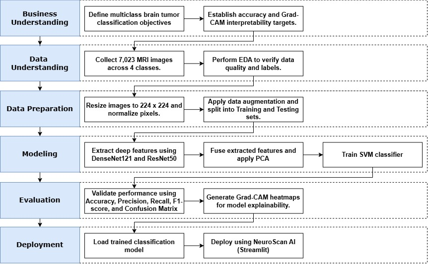

# Brain Tumor MRI Classification Using Hybrid DenseNet121-ResNet50 Feature Fusion and Support Vector Machine

Official implementation of the undergraduate thesis:

**Performance Analysis of Hybrid DenseNet121 and ResNet50 Feature Fusion with Support Vector Machine for Brain Tumor MRI Classification**

---

## 📋 Overview

Brain tumor diagnosis using Magnetic Resonance Imaging (MRI) remains a challenging task due to variations in tumor shape, size, image quality, and the complexity of manual interpretation by radiologists. This research proposes a hybrid Deep Learning and Machine Learning framework for multiclass brain tumor classification using MRI images.

The proposed framework utilizes DenseNet121 and ResNet50 as deep feature extractors. The extracted features are combined through feature fusion, reduced using Principal Component Analysis (PCA), standardized using StandardScaler, and classified using Support Vector Machine (SVM) with an RBF kernel. To improve model interpretability, Grad-CAM is employed to visualize the regions that contribute to the prediction results.

The experiments were conducted on a public MRI dataset consisting of **7,023 images** across four brain tumor categories.

---

## ✨ Key Features

- Hybrid Deep Learning and Machine Learning framework
- Transfer Learning using DenseNet121 and ResNet50
- Deep Feature Fusion through feature concatenation
- Principal Component Analysis (PCA) for dimensionality reduction
- StandardScaler for feature normalization
- Support Vector Machine (SVM) with RBF Kernel
- Explainable AI using Grad-CAM
- Multiclass Brain Tumor Classification
- Streamlit deployment (NeuroScan AI)

---

## 🎯 Key Contributions

- Proposed a hybrid CNN-SVM framework combining DenseNet121 and ResNet50 feature representations.
- Implemented Deep Feature Fusion to integrate complementary features from two pretrained CNN architectures.
- Applied Principal Component Analysis (PCA) to reduce feature dimensionality before classification.
- Compared baseline CNN models and Hybrid CNN-SVM models under identical experimental settings.
- Improved model interpretability using Grad-CAM visualization.
- Developed a prototype web application (NeuroScan AI) for real-time brain tumor prediction.

---

# 🏗 Project Architecture / Research Workflow

## Proposed Model

<p align="center">
  
</p>

The proposed hybrid framework consists of the following stages:

1. **Data Collection**
   - Brain MRI dataset (7,023 images)
   - Four classes: Glioma, Meningioma, Pituitary, and No Tumor

2. **Data Preprocessing**
   - Resize images to 224 × 224
   - ImageNet preprocessing
   - Normalization
   - Data augmentation
     - Rotation
     - Zoom
     - Width Shift
     - Height Shift
     - Brightness Adjustment
     - Horizontal Flip

3. **CNN Training**
   - DenseNet121
   - ResNet50
   - Adam Optimizer
   - Batch Size: 32
   - Initial Training: 20 Epochs
   - Fine-Tuning: 35 Epochs

4. **Feature Extraction**
   - Global Average Pooling (GAP)
   - Deep Feature Extraction
   - Feature Fusion (Concatenation)
   - PCA Dimensionality Reduction

5. **Classification**
   - StandardScaler
   - Support Vector Machine (RBF Kernel)

6. **Prediction**
   - Brain Tumor Classification
   - Grad-CAM Visualization

---

## CRISP-DM Methodology

<p align="center">
  
</p>

This research follows the CRISP-DM (Cross Industry Standard Process for Data Mining) methodology consisting of six stages:

1. Business Understanding
2. Data Understanding
3. Data Preparation
4. Modeling
5. Evaluation
6. Deployment

The developed prototype was deployed as **NeuroScan AI**, a Streamlit-based application for real-time brain tumor classification and Grad-CAM visualization.

---

# 🚀 Installation

## Requirements

- Python 3.11
- TensorFlow 2.x
- Scikit-learn
- NumPy
- OpenCV
- Matplotlib
- Pandas
- Streamlit
- ONNX Runtime

## Clone Repository

```bash
git clone https://github.com/Evan-Julian/BrainTumorMRIClassification.git

cd BrainTumorMRIClassification
```

## Install Dependencies

```bash
pip install -r requirements.txt
```

---

# 📊 Dataset Preparation

## Brain Tumor MRI Dataset

The experiments were conducted using a merged public Brain MRI dataset consisting of **7,023 MRI images**.

### Dataset Distribution

| Class | Images |
|--------|-------:|
| Glioma | 1,321 |
| Meningioma | 1,339 |
| Pituitary | 1,457 |
| No Tumor | 1,595 |
| **Total** | **7,023** |

### Dataset Sources

- Figshare Brain Tumor Dataset
- SARTAJ Brain MRI Dataset
- Br35H Brain MRI Dataset

### Dataset Structure

```text
dataset/
│
├── glioma/
├── meningioma/
├── pituitary/
└── notumor/
```

---

# 🏋 Training

## Data Preprocessing

- Resize (224 × 224)
- ImageNet Preprocessing
- Normalization
- Rotation
- Zoom
- Width Shift
- Height Shift
- Brightness Adjustment
- Horizontal Flip

## Training Configuration

| Parameter | Value |
|------------|--------|
| Optimizer | Adam |
| Loss Function | Categorical Crossentropy |
| Batch Size | 32 |
| Initial Training | 20 Epochs |
| Fine-Tuning | 35 Epochs |
| Image Size | 224 × 224 |

### Callbacks

- EarlyStopping
- ReduceLROnPlateau
- ModelCheckpoint

---

# 📊 Results

The proposed framework was evaluated using **Accuracy, Precision, Recall, F1-score, Classification Report, Confusion Matrix, and Grad-CAM visualization**. Six different models were compared under identical experimental settings.

## Overall Model Performance

| Model | Accuracy | Precision | Recall |
|--------|---------:|----------:|-------:|
| DenseNet121 | 94.89% | 0.94 | 0.94 |
| Hybrid DenseNet121 + SVM | 98.32% | 0.98 | 0.98 |
| Fusion Model | 99.08% | 0.99 | 0.99 |
| Hybrid ResNet50 + SVM | 99.24% | 0.99 | 0.99 |
| ResNet50 | 99.39% | 0.99 | 0.99 |
| **Proposed Ensemble** | **99.62%** | **1.00** | **1.00** |

The **Proposed Ensemble** achieved the best overall performance with an **Accuracy of 99.62%**, outperforming all baseline CNN models and hybrid CNN-SVM approaches. This demonstrates that combining DenseNet121 and ResNet50 through feature fusion and ensemble learning provides superior classification performance for multiclass brain tumor MRI images.

---

## Per-Class Classification Performance of the Proposed Ensemble

| Class | Precision | Recall | F1-score |
|--------|----------:|--------:|---------:|
| Glioma | **1.0000** | **0.9900** | **0.9950** |
| Meningioma | **0.9871** | **0.9967** | **0.9919** |
| No Tumor | **0.9975** | **1.0000** | **0.9988** |
| Pituitary | **1.0000** | **0.9967** | **0.9983** |

The proposed ensemble model consistently achieved high classification performance across all four brain tumor categories. The **No Tumor** class obtained a perfect recall of **1.0000**, while the **Glioma** and **Pituitary** classes achieved perfect precision (**1.0000**). These results indicate excellent robustness and generalization capability for multiclass brain tumor classification.

---

## Evaluation Metrics

The evaluation includes:

- Overall Accuracy
- Precision
- Recall
- F1-score
- Classification Report
- Confusion Matrix
- Grad-CAM Visualization
---

# 📂 Project Structure

```text
BrainTumorMRIClassification/

│
├── dataset/
│
├── models/
│   ├── DenseNet121/
│   └── ResNet50/
│
├── notebooks/
│
├── feature_extraction/
│
├── svm/
│
├── gradcam/
│
├── app/
│   └── streamlit_app.py
│
├── results/
│   ├── confusion_matrix/
│   ├── gradcam/
│   ├── accuracy_curve/
│   └── loss_curve/
│
├── requirements.txt
│
└── README.md
```

---

# 📝 Citation

If you use this work in your research, please cite:

```bibtex
@thesis{priyasa2026brain,
  author = {Muhammad Evan Julian Priyasa},
  title = {Performance Analysis of Hybrid DenseNet121 and ResNet50 Feature Fusion with Support Vector Machine for Brain Tumor MRI Classification},
  school = {Universitas Multimedia Nusantara},
  year = {2026}
}
```

---

# 🙏 Acknowledgments

This research was conducted under the supervision of the **Big Data Laboratory**, Information Systems Study Program, Universitas Multimedia Nusantara.

Special thanks to:

- Big Data Laboratory, Universitas Multimedia Nusantara
- Information Systems Study Program, Universitas Multimedia Nusantara
- Public Brain MRI Dataset Providers (Figshare, SARTAJ, and Br35H)
- Thesis Supervisor
- Universitas Multimedia Nusantara

---

# 📧 Contact

**Muhammad Evan Julian Priyasa**

Information Systems Undergraduate Student

Universitas Multimedia Nusantara

📧 Email: muhammad.evan@student.umn.ac.id

🐙 GitHub: https://github.com/Evan-Julian

💼 LinkedIn: https://www.linkedin.com/in/evanjulianp/

---

# 📜 License

This project is intended for **academic and research purposes only**.

The developed model is designed as a **Computer-Aided Diagnosis (CAD) decision support system** and is **not intended to replace professional medical diagnosis or clinical decision-making**.
